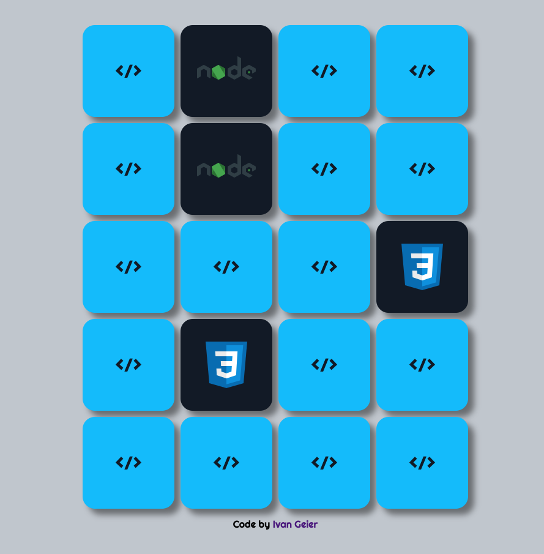

# Memory Game

I use this game to practice React. I coded this game with JavaScript some weeks ago and now I converted it to React.

## How to Run

- Clone the project to your computer
- Go to the project folder and run the application with the commands line

```
'npm instal' // to install all dependecies
'npm start' // to run the application
```

## Technologies

- React
- CSS
- HTML

## Screenshot

